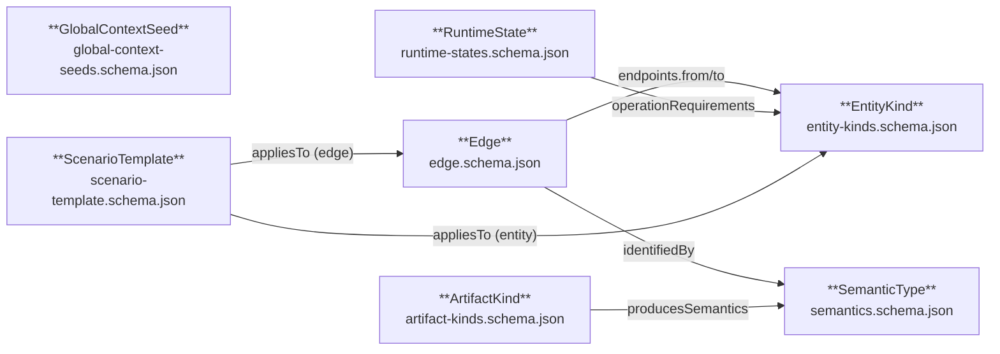
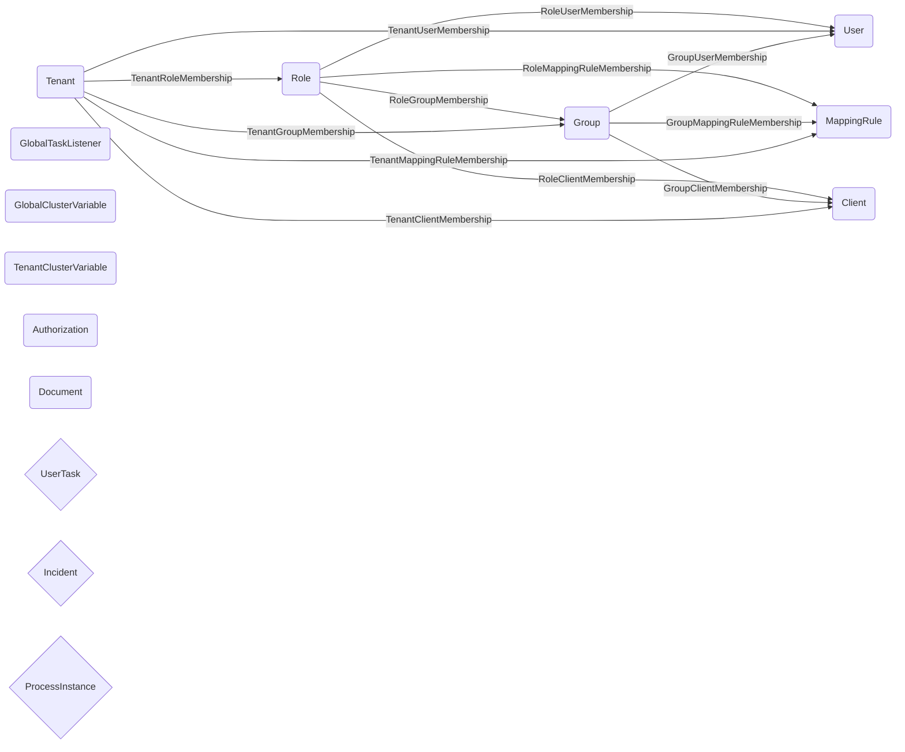

# Ontology

This directory contains the committed JSON Schema artefacts that
define the **TBox** (vocabulary / class definitions) of the
api-test-generator ontology.

The TypeScript sources of truth live under
[`path-analyser/src/ontology/`](../path-analyser/src/ontology/) — one
`*Schema.ts` file per slice. The JSON files under
[`vocabulary/`](./vocabulary/) are generated from them by
[`scripts/build-ontology.ts`](../scripts/build-ontology.ts) (`npm run
build:ontology`) so that **external SPARQL / SHACL / OWL / IDE
consumers can fetch a plain JSON Schema by URL** without first
building this repo.

A Layer-3 regression invariant in
[`configs/<config>/regression-invariants.test.ts`](../configs/camunda-oca/regression-invariants.test.ts)
fails if any committed JSON drifts from its TS source of truth, so the
generated artefacts cannot silently fall out of sync.

## Visualising the ontology

Run the visualiser to emit DOT diagrams and Mermaid snapshots:

```bash
npm run viz:ontology
```

This writes to `generated/<config>/viz/`:

| File | Description |
|------|-------------|
| `tbox.dot` | TBox class diagram (7 JSON Schema slices) |
| `abox.dot` | ABox instance graph (entity kinds + membership edges) |
| `operations.dot` | Full operation-dependency graph, clustered by OpenAPI tag |
| `tbox.mmd` | Mermaid TBox snapshot |
| `abox.mmd` | Mermaid ABox snapshot |

If `dot` (Graphviz) is on your PATH, matching `.svg` files are also
emitted. Install Graphviz with `sudo apt-get install graphviz` (Debian/Ubuntu)
or `brew install graphviz` (macOS).

The committed Mermaid snapshots in [`diagrams/`](./diagrams/) are kept
in sync by the same script, and the inline Mermaid blocks further down
this README are transcluded from those committed files (look for the
`<!-- generated-from: ontology/diagrams/*.mmd -->` markers). A
`--check` flag verifies both surfaces:

```bash
npm run viz:ontology -- --check   # verify committed .mmd files and README inline blocks are up to date
```

### TBox diagram

<!-- generated-from: ontology/diagrams/tbox.mmd -->

<!-- /generated-from -->

### ABox diagram (camunda-oca entity kinds + membership edges)

<!-- generated-from: ontology/diagrams/abox.mmd -->

<!-- /generated-from -->

For the full rendered SVGs (operations graph included), see
`https://camunda.github.io/api-test-generator/ns/v1/viz/camunda-oca/`
after a push to `main`.

## Exporting the ontology bundle

```bash
npm run export:ontology           # JSON bundle only
npm run export:ontology -- --rdf  # + Turtle (ontology-bundle.ttl) and N-Quads (ontology-bundle.nq)
```

Output goes to `generated/<config>/`:

| File | Description |
|------|-------------|
| `ontology-bundle.json` | Unified bundle of all TBox + ABox slices |
| `ontology-bundle.ttl` | Turtle serialisation of the ABox JSON-LD (`--rdf`) |
| `ontology-bundle.nq` | N-Quads serialisation of the ABox JSON-LD (`--rdf`) |

## Loading the ontology into WebVOWL / Protégé / GraphDB

Once published (after a push to `main`), the Turtle bundle is available at:

```
https://camunda.github.io/api-test-generator/ns/v1/ontology-bundle.ttl
```

### WebVOWL

1. Open [WebVOWL](https://service.tib.eu/webvowl/)
2. Click **Ontology → Load from URL**
3. Paste the URL above and click **Load**

### Protégé

1. **File → Open from URL…**
2. Paste the URL above

### GraphDB / SPARQL endpoint

```sparql
LOAD <https://camunda.github.io/api-test-generator/ns/v1/ontology-bundle.ttl>
  INTO GRAPH <https://camunda.github.io/api-test-generator/ns/v1/>
```

## Publishing

The JSON Schemas under `vocabulary/` are published to GitHub Pages by
the [`publish-ontology.yml`](../.github/workflows/publish-ontology.yml)
workflow on every push to `main` that touches the ontology surface.

Each TBox declares an absolute `$id` of the form:

```
https://camunda.github.io/api-test-generator/ns/v1/<slice>.schema.json
```

…and every per-config ABox under `configs/<config>/ontology/*.json`
uses the matching URL as its `$schema`. A structural Layer-3
invariant pins that convention so ad-hoc relative `$schema` paths
cannot creep back in.

The same workflow also publishes:

- `ns/v1/viz/camunda-oca/tbox.svg`, `abox.svg`, `operations.svg` —
  rendered operation/ontology graphs (requires Graphviz in CI).
- `ns/v1/ontology-bundle.ttl` — Turtle bundle for external RDF tooling.

A separate scheduled workflow
[`ontology-url-check.yml`](../.github/workflows/ontology-url-check.yml)
HEAD-checks every published URL weekly to catch a stuck publish
pipeline before external consumers notice the 404.

### One-time setup (repo admin)

GitHub Pages must be enabled with **Source = "GitHub Actions"**:

> Settings → Pages → Build and deployment → Source = GitHub Actions

Until this is set, the `publish-ontology.yml` `deploy` job fails with
`Get Pages site failed` — that is the expected, self-documenting
signal. No further configuration is required.

## Adding a new TBox slice

1. Add `path-analyser/src/ontology/<slice>Schema.ts` with the schema
   constant and a paired `renderSchema` wrapper. See the existing
   slices for the header conventions.
2. Register the slice in `scripts/build-ontology.ts` `ARTIFACTS`.
3. Run `npm run build:ontology` to emit
   `ontology/vocabulary/<slice>.schema.json`.
4. Add a corresponding ABox under `configs/<config>/ontology/<slice>.json`
   with `$schema` set to the canonical absolute URL.
5. Wire the loader + cross-ref module per Lift 15 / #255.
6. Add the slice's Layer-3 invariants in
   `configs/<config>/regression-invariants.test.ts`.
7. (Optional) Run `npm run viz:ontology` to preview the refreshed
   `ontology/diagrams/*.mmd` snapshots locally. You do not need to
   commit them — the `Refresh ontology diagrams` workflow opens an
   auto-PR after your change merges to `main`.

The next push to `main` touching `ontology/**` re-publishes the site.
